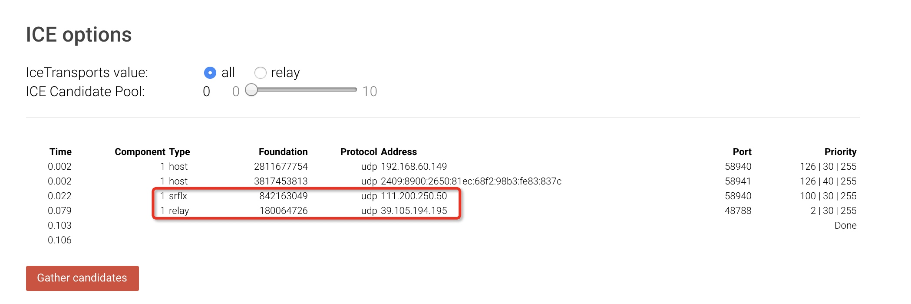

# NAT网络穿透STUN 和 TURN配置
>2021-04-09


## 一.什么是NAT
NAT（Network Address Translation，网络地址转换）简单来说就是为了解决 IPV4 下的 IP 地址匮乏而出现的一种技术，也就是一个 公网 IP 地址一般都对应 n 个内网 IP。这样也就会导致不是同一局域网下的浏览器在尝试 WebRTC 连接时，无法直接拿到对方的公网 IP 也就不能进行通信，所以就需要用到 NAT 穿越（也叫打洞）。以下为 NAT 穿越基本流程：

 

## 二.安装和配置 WebRTC 的 STUN/TURN 服务 coturn

TURN server 可以解决点对点通信里的 NAT 穿透，并提供中继（relay） 的服务。coturn 是一个开源的 TURN 和 STUN 服务器，是基于  [rfc5766-turn-server](https://code.google.com/p/rfc5766-turn-server/) 进化过来的，目前比较成熟。之所以安装 coturn 是借助它提供的 TURN 服务，解决 WebRTC P2P 通信中 STUN 服务器解决不了的复杂内网的问题。比如我尝试过移动4G 和 联通 WIFI 有时候无法通过 STUN 服务穿越内网连接，通过 TURN 服务的中继就可以解决这个问题。下面我们就来介绍一下 coturn 的安装，配置以及测试的过程。

```
Install coturn
```

coturn 安装可以参考官方的[安装文档](https://github.com/coturn/coturn/blob/master/INSTALL)，按该文档安装即可。如果是 Ubuntu 系列，可以直接通过 apt 安装，安装完成后会放在 
/usr/bin/turnserver。
```
apt install coturn
```
### 网络配置
以阿里云服务器为例，配置网络安全组/防火墙，开放 3478 的 UDP/TCP 端口，这个我们我们会作为 TURN/STUN 服务器的监听端口，并开放40000~60000的 UDP 端口，STUN 和 TURN 可能会使用随机的 UDP 端口。

### 配置 coturn

#### 1. 生成证书

这里我们先简单使用自签名证书：

```
sudo openssl req -x509 -newkey rsa:2048 -keyout /opt/turnserver/turn_server_pkey.pem -out /opt/turnserver/turn_server_cert.pem -days 99999 -nodes
```

####  2. 配置 turnserver.config

```
listening-port=3478
listening-ip=172.17.86.xxx
external-ip=39.105.xxx.xxx
min-port=40000
max-port=60000
verbose
fingerprint
lt-cred-mech
user=joey:bluebluesky
realm=mytest
cert=/opt/ssl/turn_server_cert.pem
pkey=/opt/ssl/turn_server_pkey.pem
no-loopback-peers
no-multicast-peers
no-tcp
no-tls
no-cli
```

listening-port 是监听端口，默认谁 3478，这里我们显式地配上。值得注意的是，因为阿里云使用的是专有网络(基本上目前的云服务厂商都是类似的网络)，网卡上绑定的 IP 不是外网 IP（ifconfig 得到的 IP 中不包含外网 IP），这个我咨询过客服，阿里云客服回答为了安全性，只提供专有网络。这里 listening-ip 需要填网卡绑定的 IP 地址，也就是 ifconfig 得到的地址，然后 external-ip 填外网的 IP，否则 WebRTC 获得的 relay IP 会是阿里云内网的 IP，导致连接失败。

另外这里我们配置了 long-term credential 方式的用户名和密码，这个是 WebRTC 需要的，这里简单起见，我们写死了： user=joey:bluebluesky。正式项目中，最好是使用 Time-Limited Credentials，通过 RESTful 的请求，从 TURN server 得到一个临时用户名和密码，这里简单起见，用long-term credential 的方式配置。

cert 和 pkey 就是我们前面步骤生成的，这里把相应的地址填上即可。

如果这个配置里面每一行的含义有疑问，可以参考 官方文档

#### 3. 启动 coturn

在 turnserver.conf 所在的目录，执行 turnserver -c turnserver.conf 即可。

#### 4. 测试 STUN/TURN 服务是否正常

有几种测试方式，如果你已经写好了 WebRTC 的 app，可以直接使用 turn:your-external-ip-address:3478 配置 ICE server(your-external-ip-address 需要换成刚才设置的外网IP)，用户名是 joey，密码是 bluebluesky。

```
var iceServers = {
    iceServers: [
        {
            urls: 'turn:your-external-ip-address:3478',
            username: 'joey',
            credential: 'bluebluesky'
        }]
};

connection = new RTCPeerConnection(iceServers);
```

这里我们先使用一种简单的方式，打开 WebRTC samples Trickle ICE，这个是官方的一个工具。打开后，把已有的 server 清空，添加 TURN URI： turn:your-external-ip-address:3478，TURN username: joey，TURN password：bluebluesky. 然后 Add Server 添加到 ICE server 组里。如下图：

 
 
然后点击下方的 Gather candidates，开始收集，IceTransports value 使用默认的 all 即可。coturn 默认启动是同时开启 STUN 和 TURN 服务的，所以下方如果出现的 type 有 srfix 就说明 STUN server 是正常工作的，其中 Protocol Address 表示当前的外网 IP。如果还出现了 relay 表示 TURN 服务器是正常的，其中 Protocol Address 表示 TURN 服务器的 IP 地址。

  

如果 coturn log 中提示类似 9: session 001000000000000001: realm <mytest> user <>: incoming packet message processed, error 401: Unauthorized 的提示，可以忽略。这块我花了不少时间查这个问题，以为是密码输入错了，其实是没问题的，可以忽略，参考[这里](https://groups.google.com/forum/#!topic/turn-server-project-rfc5766-turn-server/4uik2fZ6wQo)。

文章参考来源:http://enjoey.life/2018/12/10/webrtc-coturn/