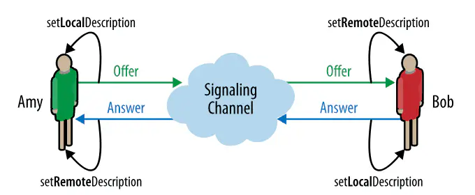
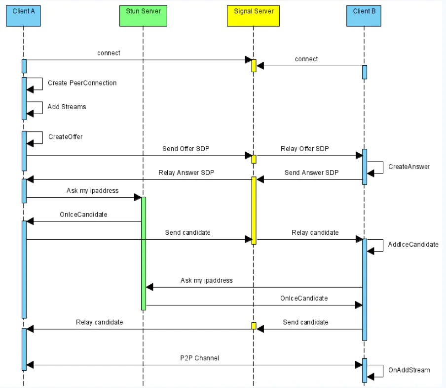

# 什么是webRTC

WebRTC源于瑞典GIPS公司，名称源自网页即时通信（英语：Web Real-Time Communication）的缩写，是一个支持网页浏览器进行实时语音对话或视频对话的API。Google 在 2011年6月1日收购了GIPS，并将webRTC开源。随后webRTC 在Google、Mozilla、Opera支持下被纳入W3C推荐标准。
简单来说，WebRTC 是一个可以在 Web 应用程序中实现音频，视频和数据的实时通信的开源项目。在实时通信中，音视频的采集和处理是一个很复杂的过程。比如音视频流的编解码、降噪和回声消除等，但是在 WebRTC 中，这一切都交由浏览器的底层封装来完成。我们可以直接拿到优化后的媒体流，然后将其输出到本地屏幕和扬声器，或者转发给其对等端。

## 信令交换

如下图所示，信令交换的流程其实就是createOffer,createAnswer。信令交换是WebRTC通信中的关键环节，交换的信息包括编解码器、网络协议、候选地址等。对于如何进行信令交换，WebRTC并没有明确说明，而是交给应用自己来决定，比如可以采用WebSocket的ws模块。 另外要注意的是，在交换信令的过程中，还需注册消息处理程序。即在服务器中添加处理来自远程计算机的消息处理程序。如果消息包含RTCSessionDescription对象,则应该使用setLocalDescription()/setRemoteDescription()方法将其添加到RTCPeerConnection对象。如果消息包含RTCIceCandidate对象,则应该使用addIceCandidate()方法将其添加到RTCPeerConnection对象。
 

## 通信候选地址交换

注册onicecandidate处理程序实现。信令交换过程中，还会涉及到ice通信候选地址的交换，如下图所示

 

可以看到，发送方在收到接收方的发回来的offer之后，立马就回去向stun服务器请求自己的ipaddress，然后stun服务器返回一个icecandidate事件，触发onicecandidate处理程序，添加icecandidate。然后发送方A再把刚刚收到的candidate发给B。B收到后同样也会向stun服务器请求自己的ipaddress，得到自己的icecandidate，并发给A。这样就实现了通信候选地址(icecandidate)交换。
 
文章来源:https://juejin.cn/post/6844903938584494088
