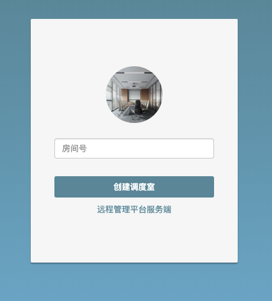

# WebRTC 远程监控监督平台Demo

> 2021-04-07

> blog.qzcool.com

> 注:当前只有浏览器端的Demo

## 一、远程调度平台界面

#### 1.远程调度平台服务端

管理人员创建调度中心房间号，客户端人员根据名称就能加入进来，服务端人员可以随时呼叫客户端人员。



#### 2.远程调度平台客户端
用户输入用户名和房间号进入调度中心。此时调度中心能看到客户端登录的视频和听到客户端的声音


## 二、平台部署

[Linux（Ubuntu）底下部署](DOC/Linux部署信令服务器.md)

### webrtc建立流程

```
ClientA -> 信令服务 - 创建房间

ClientB -> 信令服务 -加入房间

ClientA -> 发送SDP -> 信令服务 -> 转发SDP -> ClientB
```

### 消息结构定义

code:10000 成功，其他失败

```
{
    code:10000
    value:""
    message:""
}
```

### 数据结构定义

```
# 用户加入的房间
V_ROOM = {<room_name>:{'root':{'ws':<ws>},<username>:{'ws':<ws>}'}}  # 用户加入的房间
 
# websocket 对应的用户 
V_WS = {<ws>:{'room_name':<room_name>, 'type': 'root|guest', 'username': <username>}} 

//room_name:房间名称
//ws:websocket对象
//type:root创建房间的用户，guest加入到房间的用户

``` 

### code 定义

|  code   | 定义  |
|  ----  | ----  |
| 2000  | 创建房间 |
| 2001  | 加入房间 |
| 2002  | 发送Offer SDP |
| 2003  | 发送Answer SDP |
| 2004  | 发送candidate |
| 2005  | 回复candidate |
| 3000  | 客户端离开房间 |
| 3001  | 服务端挂断 |
| 3002  | 挂断客户端|


1、客户端离开房间
```
code:3000

{"code":3000,"value":""","message":"对方已挂断"}
```

3001 服务端挂断
```
{"code":3001,"value":""","message":"对方已挂断"}
```

3002 通知客户端挂断
```
{"code":3002,"value":{"username": "boy"},"message":"对方已挂断"}
```

2、创建房间
```
code:2000  

value结构
{
room_name:""
}


{"code":2000,"value":{"room_name":"123"},"message":""}

返回成功还是失败
```

3、加入房间

```
code:2001
 

{
  "code": 2001,
  "value": {
    "room_name": "123",
    "username": "boy"
  },
  "message": ""
}

```

4、发送Offer SDP

code:2002

```
{
  "code": 2002,
  "value": {
    "sdp": "444"
  },
  "message": ""
}
```

 

5、发送Answer SDP

code:2003

```
{
  "code": 2003,
  "value": {
    "username": "boy",
    "sdp": "444"
  },
  "message": ""
}
```
 
6、发送candidate


code:2004

```
{
  "code": 2004,
  "value": {
    "candidate": "444"
  },
  "message": ""
}
```

7、回复candidate


code:2005

```
{
  "code": 2005,
  "value": {
    "username": "boy",
    "candidate": "444"
  },
  "message": ""
}
```

git init
git add README.md
git commit -m "first commit"
git branch -M main
git remote add origin https://github.com/fredliu168/WebrtcExperiment.git
git push -u origin main

git pull origin main

参考：https://github.com/muaz-khan/WebRTC-Experiment/

2021-5-13
房间号和用户名去掉默认，房间号改成分钟和秒数组成的4位数
